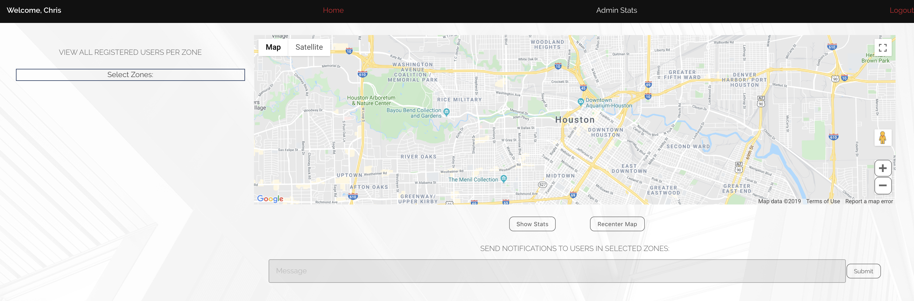

## MOBILEYES - Houston

```Emergency Response Tracking & Resource Deployment Application```

 - This is a web application deployed for disaster tracking. It was born out of a project for the Houston chapter of **Global Shapers**.
 - There are two levels of user:
    - *User* --> can create an account with a designated home address and can see all local (zip-code specific) emergency messages
    - *Admin* --> can access an entire region of statistics based on zip code
 - This application uses the following technologies:
    - Google Cloud Platform API (GeoCode, JavaScript Maps)
    - React.js
    - Google Charts
    - SCSS

 - It is live on [Heroku](https://emergency-mobileyes.herokuapp.com/login).
 - Here is a Medium [post](https://medium.com/coding-tidbits/react-app-deployment-heroku-44a91f8903c6) I wrote, explaining the deployment process.

 ***

Below are some snippets from the main views of the application. 

## Login Page


## Home Page


## Admin Statistics Pages




## Google Cloud Platform Response


